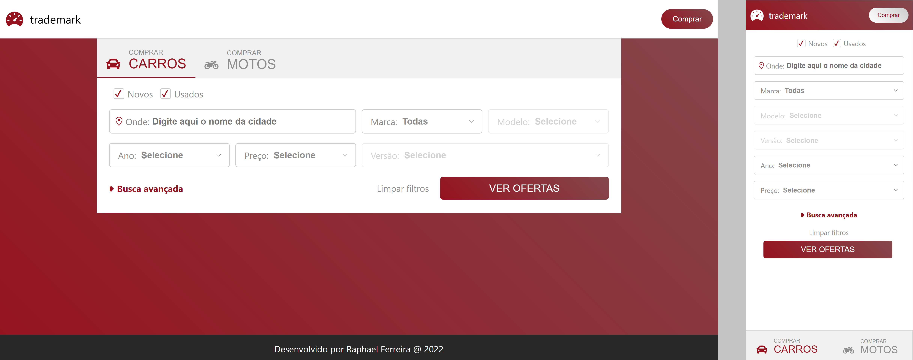

# Responsive Form

This application was created for a challenge of developing dependent fields and responsive form with different field ordering.

## Instructions

- `git clone https://github.com/raphael-ferreira/responsive-form.git`
- `cd responsive-form.git`
- `npm i` or `npm install`
- `npm start`

## Contact

If you want to contact me, follow my linkedin profile below.

---

Developed by Raphael Ferreira
